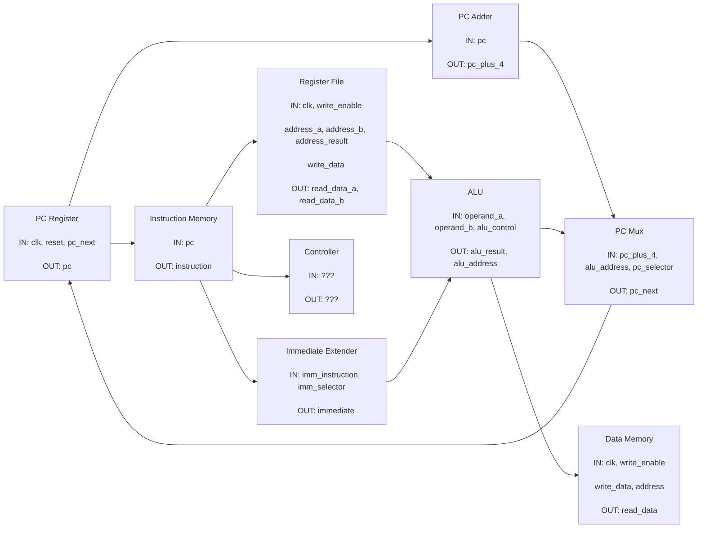

# RISC-V Single-Cycle Architecture

```mermaid
flowchart LR

    PCREG["PC Register<br/>
    IN: clk, reset, pc_next<br/>
    OUT: pc"]

    PCADD["PC Adder<br/>
    IN: pc<br/>
    OUT: pc_plus_4"]

    PCMUX["PC Mux<br/>
    IN: pc_plus_4, alu_address, pc_selector<br/>
    OUT: pc_next"]

    IROM["Instruction Memory<br/>
    IN: pc<br/>
    OUT: instruction"]

    RF["Register File<br/>
    IN: clk, write_enable<br/>
    address_a, address_b, address_result<br/>
    write_data<br/>
    OUT: read_data_a, read_data_b"]

    EXT["Immediate Extender<br/>
    IN: imm_instruction, imm_selector<br/>
    OUT: immediate"]

    ALU["ALU<br/>
    IN: operand_a, operand_b, alu_control<br/>
    OUT: alu_result, alu_address"]

    DMEM["Data Memory<br/>
    IN: clk, write_enable<br/>
    write_data, address<br/>
    OUT: read_data"]

    CTRL["Controller<br/>
    IN: ???<br/>
    OUT: ???"]

    PCREG --> PCADD
    PCREG --> IROM
    PCADD --> PCMUX
    PCMUX --> PCREG

    IROM --> RF
    IROM --> EXT
    IROM --> CTRL

    RF --> ALU
    EXT --> ALU

    ALU --> DMEM
    ALU --> PCMUX
```